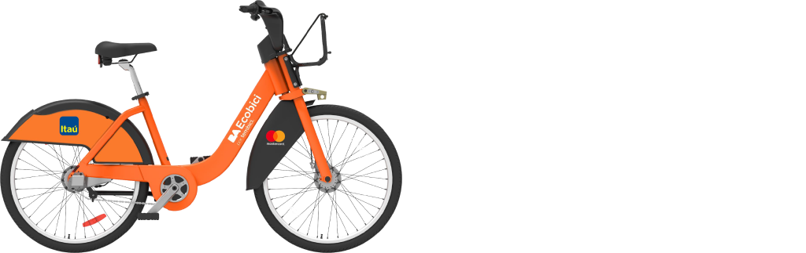
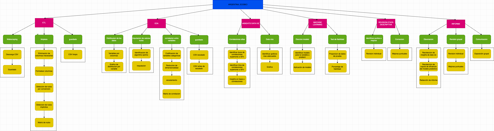
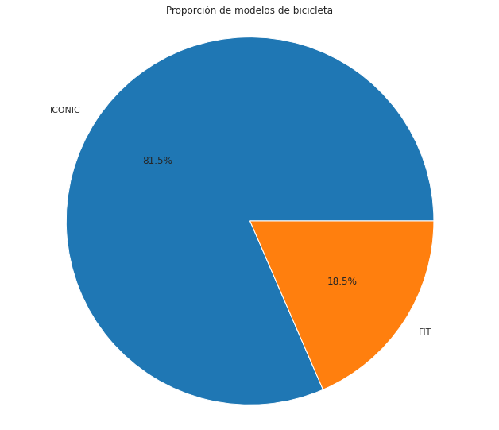

# Informe Técnico del Proyecto Ecobici 2021 en Argentina, CABA

    

## INTEGRANTES:
- Yane, Ian Cristian Ariel
- Agüi Manera, Kevin Marcos
- Ruiz, Walter

## PROFESOR:
- Perez, Narziso Hector

## MATERIA:
- Introducción a la Programación

## Índice:
1. **Resumen Ejecutivo**
2. **Introducción**
3. **Marco Teórico**
4. **Metodología**
5. **Desarrollo del Proyecto**
   - Gestión de proyectos y cronograma
   - Diseño del sistema Ecobici
   - Recopilación y limpieza de datos
   - Análisis de datos y detección de insights
6. **Resultados**
7. **Conclusiones**
8. **Referencias**
9. **Anexos**

## Resumen Ejecutivo:
Se realizó un análisis de datos públicos sobre el uso de Ecobici en Argentina durante 2021 para evaluar su potencial implementación en otras áreas.

## 1. Introducción:
Este proyecto se enfoca en el análisis de datos públicos relacionados con el uso de Ecobici en Argentina durante el año 2021. El objetivo principal es evaluar la viabilidad de implementar este sistema de transporte sostenible en otras localidades, comprendiendo su patrón de uso, correlaciones lineales y buscando lecciones aprendidas para futuras implementaciones.

## 2. Marco Teórico:
Ecobici es un sistema de bicicletas públicas compartidas implementado en la Ciudad Autónoma de Buenos Aires y gestionado por Tembici, una startup brasileña de movilidad urbana.

## 3. Metodología:
El proyecto se desarrolló principalmente en Python 3. Se utilizó web scraping con bibliotecas como requests para la recoleccion de de datos, limpieza y análisis de datos con bibliotecas como NumPy y Pandas, y visualización con Matplotlib y Seaborn.

## 4. Desarrollo del Proyecto:

### 4.1 Gestión de proyectos y cronograma
Se creó una EDT (Estructura de Desglose de Trabajo) para definir las etapas del proyecto y se estableció un cronograma detallado para su ejecución utilizando la metodologia scrum como filosofia y marco de seguimiento.
### 4.2 Diseño del sistema Ecobici
Ecobici es un sistema de bicicletas eléctricas con dos modelos, Iconic y FIT, implementado en la Ciudad Autónoma de Buenos Aires.
### 4.3 Recopilación y limpieza de datos
Los datos se obtuvieron de [BA Ecobici](https://data.buenosaires.gob.ar/dataset/bicicletas-publicas) mediante web scraping con la biblioteca Python requests y se almacenaron en la carpeta de datos brutos para su posterior limpieza.
### 4.4 Análisis de datos y detección de insights
Durante el análisis de datos, se identificaron insights clave, como la correlación entre el momento de tomar y dejar una bicicleta y la preferencia de modelos por duración y género de uso.

## 5. Resultados:
- El tiempo promedio para tomar y dejar una bicicleta es de aproximadamente 30 minutos, excepto cuando se toman por la noche, que generalmente se devuelven al día siguiente alrededor de las 16:00 horas.

    

    

- El uso por género es equitativo, con un 32% de usuarios femeninos, un 34% masculinos y el 34% restante no registrado.

    

- Aunque los modelos 'Iconic' y 'FIT' tienen tiempos de uso similares, 'Iconic' se elige en un 81.5% de los casos, mientras que 'FIT' se elige en el restante 18.5%, lo que sugiere diferentes usos.

    

    

## 6. Conclusiones:
Se observó que las bicicletas se utilizan principalmente para trayectos cortos, especialmente el modelo 'Iconic', indicando un uso común para desplazamientos breves, como mandados o ir al trabajo. 'FIT' parece destinarse a trayectos más largos o actividades deportivas. No se encontró una preferencia de género clara. Se recomienda actualizar los datos desde la [página oficial de BA Ecobici](https://baecobici.com.ar/#/es/inicio) para futuras investigaciones e incorporar software de visualizaciones dinamicas como PowerBI o Tableau.

## 7. Referencias:
- [BA Ecobici](https://baecobici.com.ar/#/es/inicio)
- [Clever Cloud](https://www.clever-cloud.com/)
- [ChatGPT](https://chat.openai.com/)

## 8. Anexos:
- [Documentos de PM](https://drive.google.com/drive/folders/1LiYvz1uxUKyjLeTANFq2zZCVFN2O4mLs?usp=drive_link)
- [Exposición del proyecto](https://drive.google.com/file/d/18sC7bRWAvGZ83kJl79oIS5SPyy-j6MiJ/view)
- [Trello - Preparación de material de trabajo](https://trello.com/b/ZgPAOBo0/preparacion-de-material-de-trabajo)
